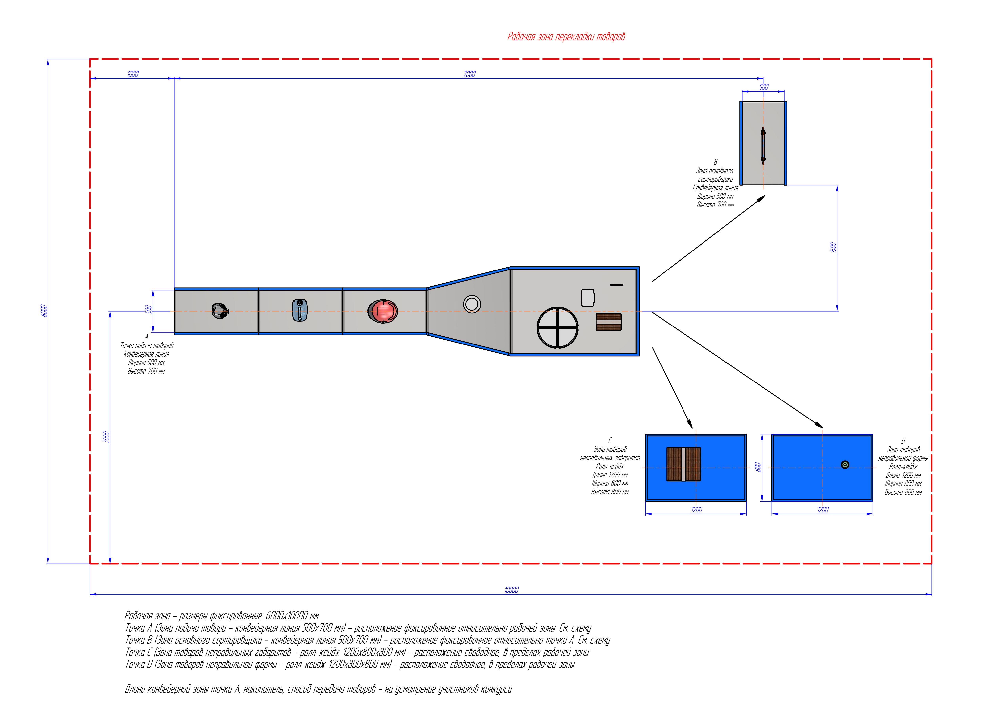

# Схема рабочей зоны перекладки товаров

> Извлечено из `docs/plan.pdf` (источник истины — сам чертёж). Рендер в высоком разрешении: `plan.png`.

## Рабочая зона

- Размеры **фиксированные: 6000 × 10000 мм** (6 × 10 м).

## Точки

| Точка | Назначение | Оборудование | Габариты | Расположение |
|---|---|---|---|---|
| **A** | Точка подачи товаров | Конвейерная линия | ширина 500 мм, высота 700 мм | **Фиксированное** относительно рабочей зоны |
| **B** | Зона основного сортировщика | Конвейерная линия | ширина 500 мм, высота 700 мм | **Фиксированное** относительно точки A |
| **C** | Зона товаров неправильных габаритов | Ролл-кейдж | 1200 × 800 × 800 мм (Д×Ш×В) | **Свободное**, в пределах рабочей зоны |
| **D** | Зона товаров неправильной формы (доупаковка) | Ролл-кейдж | 1200 × 800 × 800 мм (Д×Ш×В) | **Свободное**, в пределах рабочей зоны |

## Размеры с чертежа

- Конвейер A начинается в **1000 мм** от левой границы рабочей зоны.
- Ось конвейера A проходит в **3000 мм** от нижней границы рабочей зоны (по центру высоты зоны).
- Ширина ленты конвейера A — **500 мм**.
- Точка B (конвейер основного сортировщика): **7000 мм** по горизонтали от начала конвейера A, ориентирован перпендикулярно (вертикально на схеме), ширина **500 мм**.
- Расстояние по вертикали от оси главной линии до конвейера B — **1500 мм**.
- Ролл-кейджи C и D: **1200 × 800 мм** в плане, высота **800 мм**.

## На усмотрение участников

- Длина конвейерной зоны точки A.
- Накопитель (конструкция и расположение).
- Способ передачи товаров.

## Примечания

- Положение подающего конвейера (A) и инфида сортера (B) фиксировано и не подлежит изменению в составе решения (см. task.md, раздел 1).
- Остальные элементы ПАК и зоны вывода товаров (C, D) проектируются командой в пределах доступной площади.
