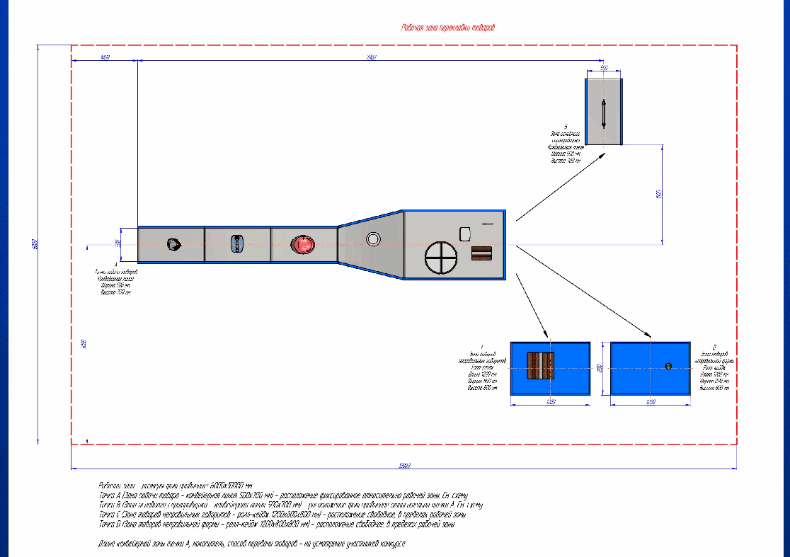
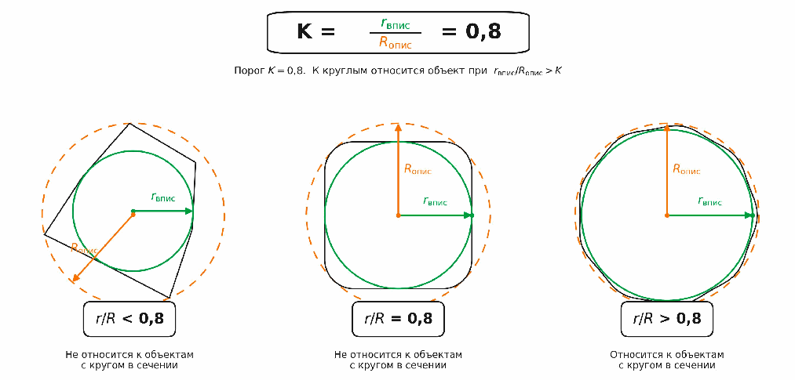

# Трек 3: Интеллектуальная роботизированная система сортировки товаров

> Конвертировано из `docs/task.pdf` (16 страниц). Схемы — в `images/`.

## Краткое описание задачи

Перед подачей товаров в автоматизированный сортировщик необходимо отделять позиции, которые могут быть корректно отсортированы, от тех, что не подходят для него по заданным признакам и должны быть направлены в другой поток обработки. Ошибка на этом этапе приводит к сбоям в дальнейшей обработке, заторам, росту ручного труда и браку при перекладке. Поэтому в рамках процесса требуется автоматизированный программно-аппаратный комплекс, который определяет класс товара на подводящем участке и физически направляет его в соответствующий поток обработки.

**Ваша задача** — разработать такой программно-аппаратный комплекс. Решение должно представлять собой связанный контур, который обеспечивает определение товара на входном участке, отнесение его к одной из заданных категорий и последующую физическую маршрутизацию в соответствующую зону обработки. Способ реализации части определения и классификации товара команда выбирает самостоятельно. Исполнительная часть, обеспечивающая захват, перекладку, перенаправление или иное физическое перемещение товара, является обязательным элементом решения.

Глубина проработки решения оценивается по двум независимым осям шкалы готовности (см. раздел «Уровень готовности решения»).

**Физический прототип исполнительной части не является обязательным требованием.** Полноценным форматом участия считается инженерно проработанное решение, подтверждённое проектными материалами, цифровой моделью, симуляцией, расчётами или их сочетанием. При этом наличие работоспособного физического прототипа или его отдельных функциональных узлов рассматривается как значимое преимущество, повышающее уровень готовности решения.

## Полное описание задачи

**Цель:** разработать программно-аппаратный комплекс, который определяет класс товара на подводящем участке, относит его к одной из заданных категорий и физически направляет в соответствующую зону обработки.

**Форма:** результатом работы команды должно стать инженерно проработанное решение, включающее часть определения и классификации товара, а также исполнительную часть для его физической маршрутизации.

- Часть определения и классификации представляется в виде реализованного подхода, кода, алгоритмов, моделей или иных средств, выбранных командой.
- Исполнительная часть представляется в виде проектных материалов, цифровой модели, симуляции, расчётного обоснования, а при наличии — также физического прототипа или его функциональных узлов.

**Проблематика:** ключевая сложность задачи заключается не только в определении класса товара, но и в том, чтобы после этого корректно выполнить его физическое перемещение в нужную зону обработки. Для работоспособности ПАК необходимо согласовать между собой несколько частей одного процесса: обнаружение объекта на входном участке, определение его класса, формирование управляющего воздействия и последующую маршрутизацию или перекладку. Ошибка, задержка или неустойчивая работа на любом из этих этапов снижает ценность всего решения. Поэтому от участников ожидается не отдельный алгоритм и не изолированная механическая концепция, а целостное решение, в котором программная и исполнительная части работают как единый контур.

---

# Требования к решению

## 0. Глоссарий

### Термины процесса и оборудования

- **Сортировочный центр (СЦ)** — логистический объект, в котором товары принимаются, обрабатываются и распределяются по направлениям отправки. В задаче рассматривается участок СЦ до основного сортировщика, где выполняется предварительный отбор и маршрутизация товаров.
- **Сортировщик (основной сортировщик)** — автоматизированная система, в которой товары распределяются по 400 направлениям отправки. Технические характеристики сортировщика заданы в постановке трека 2 и в задаче трека 3 принимаются как заданные внешние ограничения.
- **Конвейерная лента** — движущаяся поверхность, по которой товары поступают на участок предварительного отбора и маршрутизации. Поток товаров на ленте — последовательный. Подающий конвейер заканчивается накопителем, из которого товар далее забирается исполнительной частью ПАК.
- **Накопитель** — зона в конце подающего конвейера, в которой товар становится доступен для захвата и дальнейшего перемещения исполнительной частью ПАК.
- **Программно-аппаратный комплекс (ПАК)** — итоговое решение участника, обеспечивающее определение класса товара на входном участке и его последующую физическую маршрутизацию в одну из заданных зон обработки.
- **Исполнительная часть** — физический механизм комплекса, который на основе результата определения класса товара выполняет его захват из накопителя, перекладку, перенаправление или иное физическое перемещение в соответствующую зону обработки. Может быть реализована в виде роботизированной ячейки, манипулятора, толкателя, селектора, направляющих или иного безопасного механизма.

### Термины задачи

- **Категория товара** — одна из трёх взаимоисключающих категорий, к которой система относит каждый товар на входном участке:
  - **«Подходит для сортировки»** — товар соответствует ограничениям основного сортировщика: его габариты больше минимально допустимых 10 × 10 × 10 мм и меньше максимально допустимых 450 × 320 × 320 мм, а форма не относится к объектам с кругом в сечении.
  - **«Не подходит для сортировки по габаритам»** — товар не соответствует минимальным или максимальным допустимым габаритам основного сортировщика.
  - **«Не подходит для сортировки без доупаковки»** — товар относится к объектам с кругом в сечении и должен быть направлен в отдельный поток обработки перед подачей в основной сортировщик. Формальный критерий — в разделе «Правила классификации».
- **Доупаковка** — отдельная зона обработки сортировочного центра, в которую направляются товары, не подходящие для сортировки без доупаковки. Сам процесс доупаковки находится за пределами задачи, команда работает только с маршрутизацией товара в эту зону.
- **Точки A, B, C, D** — обозначения участков потока в задаче. Подробнее в разделе «Контекст и границы задачи».

### Термины алгоритмической части и оценки

- **Машинное зрение (CV)** — совокупность компьютерных методов, направленных на извлечение информации об объекте по изображению. Может использоваться для определения положения товара, его формы, ориентации, класса и иных признаков.
- **Алгоритмическая часть** — программная часть комплекса, которая выполняет определение признаков товара, его отнесение к одной из заданных категорий и формирование результата, необходимого для работы исполнительной части. Способ реализации команда выбирает самостоятельно: методы машинного зрения, алгоритмы обработки изображений, модели машинного обучения или их сочетание.
- **Foundation-модели** — крупные предобученные нейросетевые модели общего назначения, которые могут использоваться как основа для решения отдельных подзадач.
- **Инференс** — получение результата алгоритмической или обученной модели по входным данным.
- **Тестовый набор объектов** — набор товаров или их цифровых STL-моделей, предоставляемый организаторами для проверки работы решения.
- **STL-модели** — цифровые трёхмерные модели объектов из тестового набора для сред симуляции, цифрового моделирования и виртуальной проверки исполнительной части.
- **STEP-модели** — цифровые трёхмерные модели объектов в инженерном формате для CAD и иных инженерных сред проектирования.
- **Уровень готовности решения (УГТ)** — сводная характеристика зрелости решения, оцениваемая по двум независимым осям: глубина проработки части определения и классификации товара и глубина проработки исполнительной части.
- **Качество определения категории** — насколько корректно решение относит товар к одной из заданных категорий на тестовом наборе объектов или моделей.

## 1. Контекст и границы задачи

Решение работает на участке сортировочного центра, расположенном перед основным сортировщиком. На этот участок товары поступают по подающему конвейеру, который заканчивается накопителем. Именно из накопителя товар далее должен забираться исполнительной частью ПАК для последующего перемещения в соответствующую зону обработки. Часть товаров может быть направлена в основной сортировщик без дополнительных действий, часть должна быть выведена из потока и направлена в отдельную зону обработки. Без предварительного отбора такие товары попадают в основной сортировщик и вызывают сбои, заторы и ручные доработки.

**Что делает проектируемый ПАК на этом участке:**
1. Получает товар в зоне накопителя на конце подающего конвейера.
2. Определяет товар и относит его к одной из трёх заданных категорий.
3. Формирует управляющее воздействие для исполнительной части.
4. Выполняет захват товара из накопителя и его физическое перемещение в соответствующую зону обработки.

**Что находится за границами задачи:**
- работа самого основного сортировщика после точки B — это предмет трека 2;
- процесс доупаковки в точке D выполняется отдельной системой и командой не разрабатывается;
- дальнейшая судьба товаров, попавших в накопитель в точке C, находится за пределами задачи;
- распределение товаров по конкретным направлениям основного сортировщика не является предметом данного трека.

**Что поступает на вход системы:** товары, движущиеся по подающему конвейеру и накапливающиеся в накопителе на его конце. Организаторами дополнительно предоставляется набор примерных товаров и их цифровых моделей для подготовки, отладки и проверки решений. Способ определения категории товара, его положения и подготовки к физическому воздействию команда выбирает самостоятельно.

**Максимально допустимые габариты товаров, поступающих к ПАК по конвейеру: 500 × 500 × 500 мм.**

**Точки A, B, C, D:**
- **A** — точка подачи: товар поступает на участок ПАК по конвейерной ленте.
- **B** — зона основного сортировщика: товары категории «Подходит для сортировки».
- **C** — зона негабаритных товаров: товары категории «Не подходит для сортировки по габаритам».
- **D** — зона доупаковки: товары категории «Не подходит для сортировки без доупаковки».

**Параметры участка и режим работы (зафиксированы):**
- товары поступают к ПАК по подающему конвейеру;
- **скорость движения конвейера — 1 м/с**;
- подающий конвейер заканчивается накопителем, из которого товар должен забираться исполнительной частью ПАК;
- остановка подающего конвейера в базовом сценарии не подразумевается;
- положение подающего конвейера и инфида сортера является фиксированным и не подлежит изменению;
- остальные элементы ПАК и зоны вывода товаров могут проектироваться командой в пределах доступной площади, заданной на схеме участка.

Схема площадки с размерами, фиксированными элементами и доступной зоной проектирования является частью условий задачи (см. `plan.md` и `docs/plan.pdf`):

## 2. Правила классификации

Каждый товар должен быть отнесён ровно к одной из трёх категорий. Категории взаимоисключающие: один и тот же товар в рамках одного прохода по системе может быть отнесён только к одной категории.

### Категория «Подходит для сортировки»

Товары, которые **одновременно** удовлетворяют условиям:
- габариты товара больше минимально допустимых: 10 × 10 × 10 мм;
- габариты товара меньше максимально допустимых: 450 × 320 × 320 мм;
- товар не относится к объектам с кругом в любом сечении.

Направляются в зону основного сортировщика (**B**).

### Категория «Не подходит для сортировки по габаритам»

Товары, которые не соответствуют допустимым габаритным ограничениям:
- имеют размеры меньше минимально допустимых: 10 × 10 × 10 мм;
- **или** имеют размеры больше максимально допустимых: 450 × 320 × 320 мм.

Выводятся в зону негабаритных товаров (**C**).

### Категория «Не подходит для сортировки без доупаковки»

Товары, которые по габаритам могут соответствовать ограничениям основного сортировщика, но относятся к объектам с кругом в сечении. Направляются в зону доупаковки (**D**).

### Критерий «круг в сечении»

Формальный критерий отнесения товара к объектам с кругом в любом из сечений объекта задаётся через коэффициент сравнения радиусов вписанной и описанной окружности:

**K = r_впис / R_опис = 0,8** — порог. К круглым относится объект при **r_впис / R_опис > K** (строго больше; при r/R = 0,8 объект НЕ относится к круглым).

### Общий порядок принятия решения

1. Сначала проверяется соответствие товара допустимым габаритам основного сортировщика.
2. Если товар не проходит по габаритам — категория «Не подходит для сортировки по габаритам».
3. Если товар проходит по габаритам, далее проверяется, относится ли он к объектам с кругом в сечении.
4. Если относится — категория «Не подходит для сортировки без доупаковки».
5. Если товар проходит обе проверки — категория «Подходит для сортировки».

Проверка строится от более жёсткого ограничения по габаритам к последующей проверке формы.

**Приоритет правил:** товар, имеющий круг в сечении и одновременно выходящий за допустимые габариты, относится к категории **«Не подходит для сортировки по габаритам»** (габариты приоритетнее формы).

## 3. Уровень готовности решения

Используется адаптированная шкала на основе TRL / УГТ (ГОСТ Р 58048-2017). Решения оцениваются по **двум независимым осям**.

### Ось 1. Глубина проработки части определения и классификации товара

- **Уровень 1. Базовый прототип** — базовый рабочий контур, позволяющий относить товар к одной из трёх категорий; минимально работоспособный подход с базовой проверкой на собственных примерах или части тестового набора.
- **Уровень 2. Полноценное решение** — обоснованный подход, демонстрация работы на тестовом наборе, устойчивая обработка трёх категорий в типовом режиме.
- **Уровень 3. Глубокая проработка** — проработка сложных и пограничных случаев, обоснованная обработка неоднозначных ситуаций, анализ ошибок, работа с дополнительными признаками.
- **Уровень 4. Зрелое подтверждённое решение** — устойчивая и воспроизводимая работа на тестовом наборе, анализ качества, ограничений и пограничных случаев, подтверждение в составе целостного решения, связанного с исполнительной частью.

### Ось 2. Глубина проработки исполнительной части

- **Уровень 1. Концепция** — описание принципа работы, общая схема маршрутизации товара между точками A, B, C, D, тип механизма.
- **Уровень 2. Базовая инженерная проработка** — компоновка участка перекладки, ключевые узлы и логика их работы, первичные расчёты, описание передачи результата классификации в исполнительную часть.
- **Уровень 3. Детализированный проект** — 3D-модель ячейки или участка перекладки, чертежи или кинематические схемы, спецификация узлов, расчёты или симуляция под заданные условия, проработка нештатных ситуаций.
- **Уровень 4. Зрелое подтверждённое решение** — исполнительная часть подтверждена либо валидированной цифровой моделью/симуляцией, сопоставленной с расчётами, либо работоспособным физическим прототипом.

### Матрица итогового балла (максимум 20)

| | Исполн. 1 Концепция | Исполн. 2 Базовая проработка | Исполн. 3 Детализированный проект | Исполн. 4 Валидированная модель / прототип |
|---|---|---|---|---|
| **CV 1. Базовый прототип** | 2 | 4 | 6 | 8 |
| **CV 2. Полноценное решение** | 3 | 6 | 9 | 12 |
| **CV 3. Глубокая проработка** | 4 | 8 | 12 | 17 |
| **CV 4. Зрелое валидированное решение** | 5 | 10 | 15 | 20 |

Более высокий уровень проработки исполнительной части оказывает на итоговый балл не меньший, а в ряде сочетаний — больший эффект, чем аналогичный рост только по оси определения и классификации.

## 4. Вид результата и состав итогового решения

Итоговое решение — связанный проект программно-аппаратного комплекса, объединяющий часть определения и классификации товара и исполнительную часть.

**Обязательный состав сдачи:**
- описание реализованного подхода к определению и классификации товара;
- исходный код алгоритмической части и материалы, необходимые для проверки её работы;
- проектные материалы по исполнительной части: схема компоновки участка перекладки, описание ключевых узлов и логики их работы, принцип маршрутизации товара между точками A, B, C, D;
- цифровая модель, симуляция или расчётное обоснование исполнительной части;
- описание связи между частями: как результат определения категории преобразуется в управляющий сигнал, какие ограничения по темпу работы и геометрии участка учтены;
- итоговый отчёт команды;
- видеодемонстрация работы решения.

**Дополнительные материалы (по выбору команды):**
- расширенные проектные материалы: 3D-модели, чертежи, кинематические схемы, спецификации узлов, алгоритмы управления;
- результаты дополнительных проверок и экспериментов: анализ ошибок, устойчивость, пограничные случаи;
- физический прототип исполнительной части или её узлов;
- сценарии и тестовые примеры для пограничных и нештатных случаев.

**Размещение и проверка симулятивных и цифровых решений:** цифровые модели, симуляции и программные артефакты разворачиваются на серверной среде организаторов с установленным перечнем допустимого ПО. Эксперты запускают симуляцию, изменяют входные параметры и оценивают поведение системы. Команда обязана предоставить:
- инструкцию по запуску с версиями ПО, зависимостями и порядком действий;
- описание среды развёртывания и требований к ресурсам;
- описание входных параметров, которыми может управлять эксперт;
- описание сценариев проверки.

## 5. Фиксация работы в отчёте

Отчёт — основной документ, по которому жюри понимает выбранный подход и достигнутый уровень готовности по каждой оси.

- **Раздел по части определения и классификации:** исходные данные, выбранный подход и обоснование, логика определения категории, проверки и результаты, разбор ошибок и пограничных случаев, ограничения и направления развития.
- **Раздел по исполнительной части:** принцип работы участка перекладки, состав и логика узлов, расчёты и обоснование производительности, проверки на цифровой модели или симуляции, нештатные сценарии, инженерные ограничения. При наличии физического прототипа — состав, режимы работы, подтверждённые характеристики.
- **Связь между частями описывается отдельно:** как результат классификации преобразуется в управляющий сигнал, какие ограничения накладывает темп ленты и геометрия участка, как обрабатываются неоднозначные случаи. Без описания этой связи решение оценивается как два изолированных компонента.

## 6. Справочная информация и рекомендации (не накладывает требований)

### Машинное зрение на конвейере

Типовые задачи: классификация, детекция, сегментация. Более распространённая схема — двухступенчатый пайплайн: детекция/сегментация для локализации товара, затем классификатор поверх вырезанной области (один кадр почти никогда не содержит ровно один товар по центру).

Распространённые семейства подходов:
- классические нейросетевые классификаторы (ResNet, EfficientNet, ConvNeXt) — просто и быстро для одного товара в кадре;
- двухступенчатый пайплайн с детекцией (YOLO, RT-DETR, RF-DETR) и классификацией — стандарт в промышленных конвейерных системах;
- мультимодальные модели (CLIP, SigLIP, DINOv2) — для нестандартных категорий и ограниченного датасета;
- классические методы CV (контурный анализ, морфология, цветовая сегментация) — сильны в стабильных условиях съёмки и для геометрических признаков без нейросетей.

Геометрические признаки (размеры, соотношение сторон, ориентация) часто извлекаются отдельным алгоритмом по калиброванной камере: зная высоту установки и параметры объектива, можно по 2D-изображению оценить реальные габариты на плоскости ленты. Для штрихкодов есть готовые решения (pyzbar, ZXing).

### Исполнительная часть на конвейере

- **Поперечные толкатели и сбрасыватели** — просто и дёшево, для коробок и устойчивых форм; плохо для цилиндрических и хрупких товаров.
- **Поворотные лотки и шиберы** — направляют товар в одну из смежных зон без захвата, широкий спектр форм.
- **Управляемые направляющие и роликовые столы** — мягкое перенаправление, для деликатных товаров.
- **Роботизированные ячейки с манипулятором и захватом** — самый гибкий вариант для разнородного потока, но требует проработки безопасности и ограничен по скорости на единицу.
- **Пневматические/вакуумные селекторы** — точечно снимают товары с ленты, для разреженных потоков.

Выбор опирается на: темп потока, разнообразие форм, требования к мягкости обращения, доступную площадь.

### Связка алгоритмической и исполнительной части

- **Синхронизация по времени:** между попаданием товара в кадр и командой исполнительной части проходит время на инференс, передачу и реакцию контроллера — товар успевает сместиться. Решения: классификация с опережением (до точки сброса) либо пересчёт положения по известной скорости ленты.
- **Неоднозначные случаи:** в индустрии товары с низкой уверенностью классификатора отправляются в отдельный поток на повторный прогон или ручной разбор.
- **Контроль качества:** метрика «корректность маршрутизации» на длинных горизонтах, а не только на отдельных кадрах — для выявления дрейфа модели и проблем датчиков.

### Рекомендуемый порядок работы (наблюдение из практики)

1. Сначала — минимальный сквозной прототип от входного изображения до условного управляющего сигнала, даже с простейшей моделью и упрощённой механикой.
2. Затем последовательное углубление каждой части: модель, механика, нештатные случаи.
3. В последнюю очередь — полировка (визуализация, оформление, видео).

Это устойчивее последовательной глубокой проработки частей по очереди: на стыке часто возникают неожиданные ограничения, и обнаруживать их лучше раньше.

## Технические требования к решению и его презентации

**Формат решения:** комплект материалов по обеим частям решения. **Подход к реализации** — на усмотрение команды. **ПО:** допускается открытое, проприетарное и собственное; все инструменты, библиотеки, модели и сервисы указываются в отчёте. Допускаются локальные и облачные вычисления, если это явно отражено и не мешает проверке.

**Проверяемость:** живая демонстрация, видеодемонстрация, показ симуляции/цифровой модели, работа на тестовом наборе, или комбинация. Дополнительно — проверка в серверной среде организаторов.

**Видеодемонстрация обязательна.** Если есть симуляция/модель/прототип — демонстрируется их работа; если решение в основном проектное — разбор проекта по ключевым материалам.

Жюри должно иметь возможность проверить:
- как система определяет категорию товара;
- как обрабатываются три заданные категории;
- как результат классификации передаётся в исполнительную часть;
- как реализуется перекладка/перенаправление товара;
- работу на тестовом наборе объектов или моделей;
- учёт временных ограничений: темп ленты, реакция исполнительной части, cycle time;
- поведение в пограничных и нештатных ситуациях.

### Размещение материалов

**Центральная точка сдачи — GitHub-репозиторий команды** с `README.md` как корневым сводным документом. В репозитории:
- README.md;
- итоговый отчёт;
- презентация для защиты;
- исходный код части определения и классификации, конфигурации, скрипты;
- исходный код алгоритмов управления исполнительной частью (если реализуются);
- файлы симуляции, цифровых моделей и сопутствующие скрипты;
- инструкции по запуску и проверке в серверной среде (версии ПО, зависимости, порядок действий);
- описание структуры решения (что относится к классификации, что к исполнительной части, что к связке и сценариям проверки).

**В облачном хранилище организаторов** — объёмные бинарные материалы: модели и веса, датасеты, CAD-файлы и 3D-модели в исходных форматах, файлы проектов инженерного ПО, полная видеодемонстрация, прочие крупные артефакты. Все ссылки на облако собираются в README.md с пояснениями. Специальные зависимости, лицензии, модели, веса и нестандартная настройка окружения явно описываются в README.md с источниками, версиями и порядком установки.

### Презентация решения

Формат: живая демонстрация, видеодемонстрация или сочетание. **Не более 7 минут**, включая демонстрацию.

Рекомендуемая структура:
1. О команде.
2. Постановка задачи и подход к решению.
3. Логика классификации товаров.
4. Схема маршрутизации по точкам A/B/C/D.
5. Исполнительная часть и способ автоматической перекладки.
6. Подтверждение работоспособности: метрики, симуляция, расчёты, цифровой прототип.
7. Используемые инструменты и причины выбора.
8. Ограничения решения и идеи развития.
