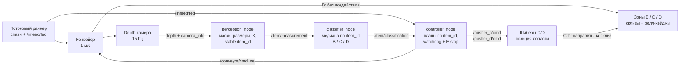

# Архитектура непрерывного контура — v0.5-stable-stream

> Актуальное состояние ядра, замороженного тегом `v0.5-stable-stream`
> (17.07.2026, этапы 21–25 закрыты). Источники обоснований —
> `docs/decisions.md`, метрик — `docs/experiments.md`, устройство механизма —
> `mechanism.md`, размерная компоновка — `layout.md`. Финальный мир —
> `sim/worlds/cell_diverter.sdf`; старый
> `cell.sdf` с баллистическими толкателями сохранён только как измеренный baseline.

## Контур данных и физического воздействия



Это один замкнутый ПАК, а не отдельные демонстрации CV и механики. Тот же
`item_id`, который появился из маски камеры, является ключом медианной
агрегации, таймера шибера, защиты от двойного срабатывания и диагностического
лога. Физическая доставка в зону проверяется по геометрии **тела**, а не origin
модели Gazebo.

## Узлы и контракты

| Узел | Вход | Выход | Ответственность |
|---|---|---|---|
| `ros_gz_bridge` | топики Gazebo | ROS 2 camera, `/clock`; команды обратно в Gazebo | Единый мост из `sim/bridge.yaml`; все ноды работают с `use_sim_time` |
| `perception_node` | `/camera/depth_image`, `/camera/camera_info`; классификация только для overlay | `/item/measurement` | Находит все depth-компоненты кадра, консервативно разделяет соприкасающиеся маски, измеряет габариты тела (2D OBB или защищённый 3D body-OBB для рельефной наклонной поверхности), K/позицию и сохраняет ID при перестановке и коротком пропуске |
| `classifier_node` | `ItemMeasurement` | `/item/classification` | Копит историю отдельно по каждому ID, берёт медиану размеров и K, вычисляет confidence и применяет правила B/C/D с приоритетом габаритов |
| `controller_node` | `ItemClassification`, `/infeed/fed`, `/emergency_stop` | `/conveyor/cmd_vel`, `/pusher_{c,d}/cmd` | Перепланирует таймер каждого товара по свежей позиции, но допускает не более одного физического действия на ID; управляет общими шиберами и защитами |
| `run_stream.sh` | список `slug:zone:gap_m`, seed и ориентация | поток товаров, `stream.log`, body-scored результат | До запуска проверяет допустимость расстояний и ход ленты; подаёт на уже идущую ленту без перезапуска мира |

`ItemMeasurement.msg` содержит время кадра, `item_id`, три габарита в мм, K,
confidence и позицию в метрах. `ItemClassification.msg` переносит те же
измерения и добавляет категорию. Категория сознательно отсутствует в сообщении
perception: правила задачи принадлежат классификатору, а не камере.

## Жизненный цикл нескольких товаров

1. Раннер кладёт товар на уже идущую ленту и публикует `/infeed/fed`.
2. Perception может выдать несколько измерений из одного кадра. Tracker
   сопоставляет центроиды с предыдущим кадром и выдаёт монотонные ID.
3. Агрегатор хранит независимую LRU-историю каждого ID. Межкадровое чередование
   `1, 2, 1, 3, ...` не смешивает размеры разных товаров.
4. Контроллер хранит `pending`, `fired` и `done` по ID. До выстрела новый кадр
   отменяет старый таймер и пересчитывает момент; после выстрела категория уже
   не может вызвать второе действие.
5. Шибер — общий физический ресурс зоны. Повторное срабатывание той же зоны
   продлевает удержание и заменяет старую цепочку возврата; смена зоны требует
   зазора `hold + retract`, который проверяет `stream_plan.py`.
6. Завершённые ID удаляются по TTL, поэтому длинный поток не наращивает память
   бесконечно.

## Механизм и временная синхронизация

Финальные исполнительные органы — две поворотные лопасти длиной 0,8 м в точках
`x=3,25 м` (C) и `x=3,75 м` (D). Команда `0,90 рад` формирует направляющую стенку;
лента сама сдвигает товар вдоль неё на низкофрикционный склиз. Команда отправляется
примерно за 0,5 с до расчётной линии, лопасть удерживается 2,5 с и возвращается за
0,6 с. Топики исторически называются `/pusher_*`, но в финальном мире несут
**целевой угол**, а не скорость толкателя.

Dead-reckoning использует скорость 1 м/с и время кадра из ROS Header. Все таймеры
контроллера идут по `/clock`; измерение старше 1 с отвергается, потому что смесь
wall time и sim time иначе даёт правдоподобную, но неверную команду. Заявляемый
sustained-результат — **медиана 10 товаров/мин** на полной матрице всех 11
моделей (`run_stream_suite.sh 0 0 2`, 33/33; p95-медленный такт 4); пиковый
короткий 3-товарный поток даёт 18, но за sustained не выдаётся. Камера→решение —
медиана 0,030 с на полной матрице (0,094 с на 3-товарных прогонах); решение→команда
1,90 с. Первая задержка измеряется напрямую по общему sim-clock кадра и решения,
а не разностью строк из разных процессов (`measure_throughput.py`, `mechanism.md`).

## Безопасное состояние и явные отказы

- **Feed watchdog:** после каждого `/infeed/fed` новый ID должен появиться у
  камеры за 8 с. Иначе причина называется `FEED JAM`, и E-stop защёлкивается.
- **Jam в окне камеры:** если видимый товар не продвинулся хотя бы на 5 см за
  2 с при движущейся ленте, дальнейшая подача и действия блокируются.
- **E-stop:** отменяет таймеры и останавливает ленту. Скоростной толкатель
  замораживается нулевой скоростью; позиционный шибер повторно получает текущий
  угол, а не команду парковки — механизм не выезжает из-под товара.
- **Противоречие после срабатывания:** поздняя другая категория не запускает
  механизм повторно, но остаётся видимой как `possible mis-sort` в логе.
- **Пограничная геометрия:** вырожденная или неразделимая маска остаётся одним
  товаром вместо падения perception. Недо-разделение безопаснее фантомного ID и
  аварии всей камеры.

## Граница цифрового прототипа

Репозиторий содержит исполняемую функциональную модель: геометрию SDF,
коллизии, кинематику, ROS-контракты, алгоритмы восприятия/управления и
воспроизводимые проверки маршрута. Узлы в таблице выше — спецификация
программного контура; SDF фиксирует проверенные координаты и рабочие зазоры.

Это **не production STEP-сборка и не safety-certified проект**. Перед физической
реализацией нужны расчёт привода и шарнира, прочность и ресурс, допуски и крепёж,
выбор промышленной depth-камеры/ПЛК, кабельные трассы, оценка рисков,
сертифицированное ограждение с блокировками и аппаратный E-stop. Прозрачные
collision-only бортики в окне камеры моделируют внутренние направляющие товара,
а не защиту человека. Размерная граница между проверенной SDF и будущей
конструкторской проработкой сведена в `layout.md`, safety-граница — в `safety.md`.

## Воспроизводимость

```bash
# Один товар на финальном механизме
WORLD=sim/worlds/cell_diverter.sdf bash scripts/run_skeleton.sh box_300x200x200 B

# Multi-item поток и расчёт его ограничений до запуска Gazebo
bash scripts/run_stream.sh
STREAM_DRY_RUN=1 bash scripts/run_stream.sh box_400x400x300:C:0 pen:C:1.0 bottle:D:3.5

# Полная матрица 11 товаров × 3 ориентации
WORLD=sim/worlds/cell_diverter.sdf bash scripts/run_matrix.sh 0 3

# Потоковая suite всех 11 моделей (источник sustained-заявки 10 шт/мин)
bash scripts/run_stream_suite.sh 0 0 2

# Нештатные и multi-item сценарии
bash scripts/smoke_multi_item.sh
bash scripts/smoke_estop_stream.sh
```

Два census первого слитого состояния после сведения прозрачных бортиков, 3D
body-OBB и touching-perception дали `33/33 + 33/33`. Финальный gate замороженного
ядра `v0.5-stable-stream`: два полных потоковых suite подряд `33/33 + 33/33` и
body-scored census `33/33` с classification=0 и execution=0
(`experiments.md` 2026-07-17). Ограничение честности: seed
фиксирует сцену и ориентации, но контактная физика Gazebo имеет небольшой шум;
поэтому ревизии не смешиваются в один знаменатель, а каждый результат хранит
собственный каталог и triage.

Иллюстрации: `img/day1_camera_rgb.png` — сцена камеры,
`img/day9_overlay_ids_state.png` — bbox, стабильные ID и состояние агрегации.
