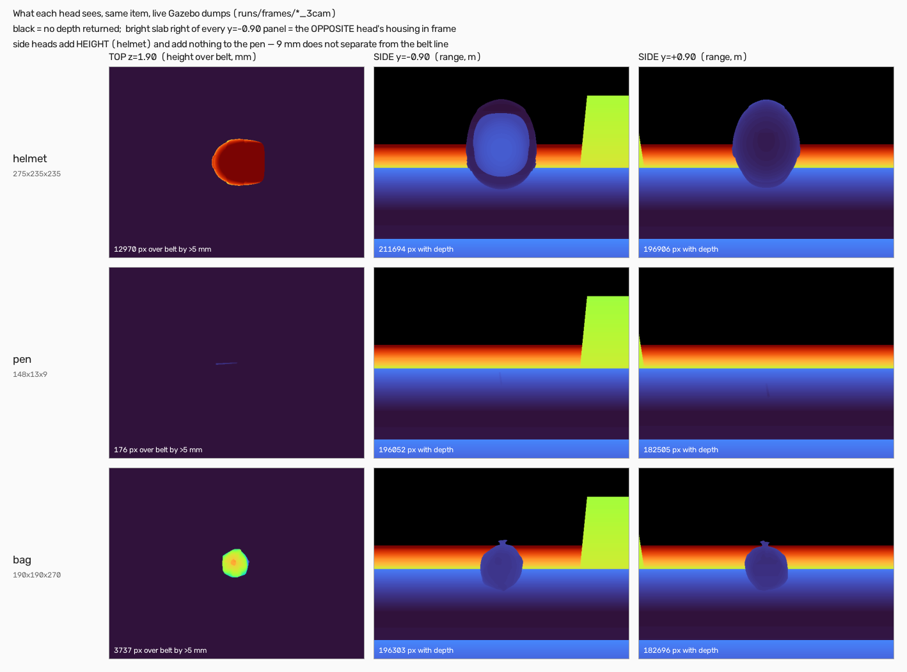

# Камеры: измеренное расхождение

> Сколько ракурсов нужно ячейке пресортировки — и почему на оценку идёт один,
> а на реальную линию мы закладываем два. Ответ получен постройкой и замером
> четырёх конфигураций, а не выбором. Здесь сведены **все** числа развилки, у
> каждого названа его рамка, и явно сказано, что оно доказывает и что НЕ
> доказывает. Отдельно, в §8, — четыре свойства, у которых числа нет и не будет:
> они доказаны **по строкам кода**, и одно из них объясняет, почему один замер
> мы сознательно не гоняли.
>
> Дополняет, а не повторяет: [§2.8 методологии](methodology_and_limitations.md)
> — почему построенная третья головка не взята; [industry_comparison.md](industry_comparison.md)
> — отраслевые конфигурации; [path_to_line.md](path_to_line.md) — 16 режимов
> отказа реальной линии.

## 1. Решение

| Горизонт | Сколько камер | Почему |
|---|---|---|
| **Отгружаем на оценку** | **1 верхняя** | Провалидированное сквозь контур по пяти seed: **163/165**. Две головки, прогнанные тем же контуром по тем же seed, дают **ровно то же 163/165** (§2.3) — камера маршрутизацию не двигает. Оба промаха — классификационные (K на пороге), их **никакая камера не чинит**: K берётся только с верхней головки и слиянием не трогается (`src/perception_node.py:158-160`), а слияние по построению может габарит только раздуть, но не уменьшить (`src/multiview.py:141-142` — для габаритов, отсортированных по убыванию, а прод производит только такие: `src/perception.py:708`; §8 T1–T2). |
| **Отгружаем как опцию** | собранные 2- и 3-камерные миры, мосты, слияние | Путь деградирует до верхней головки бит-в-бит (`src/multiview.py:116-121`: нет годных боковых облаков — возвращаются верхние габариты) и весь под тестами (`tests/test_multiview.py`, `tests/test_bridge_2cam.py`, `tests/test_bridge_3cam.py`). Отгрузка опции не стоит ничего и показывает проработку. |
| **Закладываем в реальную линию** | **2 минимум, 3 — покрытие дальнего фланга** | Обоснование — **доступность** (выпадение возврата глубины на тёмной, бликующей, прозрачной упаковке), а не точность. Наш бесшумный Gazebo этого явления не содержит вообще, поэтому довод расчётный: паспорт сенсора D435-класса + отрасль ([SICK VMS4200/5200 — две головки, Cubiqnet — три плоскости](industry_comparison.md)). **Но доступность придётся ещё построить, и это надо сказать раньше, чем спросят: отгружаемый контракт слияния её не даёт ни при двух головках, ни при трёх.** Боковой кадр входит в измерение только внутри объёма, который верхняя головка уже назначила товару (кроп по `measurement.position_m` и `measurement.dims_mm`, `src/perception_node.py:96-115`), а публикация в ячейке ровно одна — внутри обработчика верхнего кадра (`src/perception_node.py:163`). Нет верхнего кадра — нет измерения при любом числе боковых (§8 T3). Редундантность у нас — **проектное требование к следующей версии слияния**, а не уже измеренное свойство. |

Организаторы прямо разрешают любое число камер «чтобы охватить все грани»
(`docs/md/expert_session_qa.md`). Мы этим воспользовались — построили стойку,
измерили её и **на основании измерения** не поставили её на путь оценки.

Рисунок — живые кадры Gazebo из `runs/frames/*_3cam`, снятые 25.07, а не схема
(`scripts/plot_head_views.py`, утверждения закреплены в
`tests/test_plot_head_views.py`). На нём читаются три вещи, которые ниже
доказываются числами:

- **боковые головки дают высоту.** Шлем сверху — купол без границы, сбоку —
  силуэт целиком. Это и есть весь измеренный прирост 27/33 → 30/33 (§2.4);
- **на самом трудном товаре каталога они не дают ничего.** Ручка лежит на 9 мм
  над лентой: сверху это **176 px** против 3737 у Мешка и 12970 у Шлема, а с
  боков она не отделяется от линии ленты вообще. Товар, на котором стоит граница
  C/B, стойка не спасает — ни двумя головками, ни тремя;
- **салатовый прямоугольник справа в каждом кадре `y=-0.90`** — это ограждение
  накопителя зоны C, а НЕ корпус противоположной головки. Исправлено 26.07: модель
  `zone_c` стоит в (3.2, 0.9), стенка смещена на (0, 0.6, 0.4), то есть мир
  y = 1,5 при z 0,005–0,805 — ровно там, где лежат восстановленные точки
  (x 1,98–2,93, y 1,47–1,99, z 0,00–0,80). Камера в этих кадрах появиться не может
  в принципе: у всех трёх моделей камер в `sim/worlds/cell_diverter_3cam.sdf` есть
  `<sensor>` и **нет ни `<visual>`, ни `<collision>`**, а в обоих боковых облаках
  **ровно ноль** точек в диапазоне |y| ∈ [0,80; 1,00], где стоят головки
  (`test_no_head_body_appears_in_any_side_frame`).

Рамка рисунка: **три товара в одной позе покоя**, а не каталог и не проезд по
ленте. Он показывает механизмы, названные в §2.4 и §4, и не измеряет их частоту.

## 2. Четыре источника чисел, и их нельзя складывать

Это главное методическое правило раздела. У каждого замера своя рамка; сложение
чисел из разных рамок один раз уже дало нам ложную цифру 92 %
([методология](methodology_and_limitations.md), «урок 92 %»).

### 2.1. Офлайн-зонд, 165 поз, с моделью ошибки калибровки

`scripts/probe_camera_count.py`. Мисроуты от истинной зоны — **меньше лучше**:

| Калибровка | 1: верх | 2: верх + бок | 3: два бока |
|---|---|---|---|
| идеальная (геометрический предел) | 8,0 | **0,0** | 3,0 |
| типичная 2 мм / 0,2° | 8,0 | **4,3** | 9,0 |

Доля измерений в допуске организаторов — **больше лучше**:

| Калибровка | 1 | 2 | 3 |
|---|---|---|---|
| идеальная | 47 % | 81 % | **95 %** |
| типичная 2 мм / 0,2° | 47 % | 81 % | **89 %** |

**Обе таблицы выше сняты правилом `union`, и 26.07 выяснилось, что это правило
подаёт `_body_obb_dims_mm` фиктивный ящик 1e4 и потому ВСЕГДА возвращает
наклонный бокс — оценщик, которого в ячейке нет** (`scripts/probe_camera_count.py`
предупреждал об этом в собственных комментариях). Тот же прогон продовым
контрактом (`union-prod`: теневой ящик выигрывает, пока наклонный не меньше по
объёму) и продовым классификатором даёт другую картину, и цитировать надо её:

| Калибровка | 1: верх | 2: верх + бок | 3A: два бока | 3B: бок + вдоль ленты |
|---|---|---|---|---|
| в допуске, идеальная | 79 % | 82 % | **96 %** | 89 % |
| в допуске, типичная 2 мм / 0,2° | 79 % | 82 % | **92 %** | 85 % |
| в допуске, посредственная 3 мм / 0,3° | 79 % | 81 % | 83 % | 77 % |
| мисроуты `classify_conservative`, типичная | 0,0 | 0,7 | **0,3** | 0,3 |

Два вывода, которых старая таблица не давала. **Первый: штраф за лишние головки
существовал в строгом классификаторе, а не в камерах** — на продовом правиле
мисроуты 3A падают с 6,3 до 0,3, потому что консервативная полоса 5 мм поглощает
раздувание габарита. **Второй: преимущество третьей головки целиком
калибровочное** — +14 п.п. при идеальной калибровке, +10 при типичной и всего
+2 при посредственной, тогда как две головки на всём диапазоне теряют 1 п.п.

**Доказывает:** свойство ГЕОМЕТРИИ ИЗМЕРЕНИЯ при заданной ошибке калибровки.
**НЕ доказывает:** ничего про контур — зонд не моделирует ни ленту, ни кроп, ни
трекер, ни агрегацию по кадрам.

### 2.2. Полный контур Gazebo, перепись 33 ячейки, seed 0

| | 1 головка | 2 головки | 3 головки |
|---|---|---|---|
| маршрутизация, чистый мир | 33/33 | 33/33 | 33/33 |
| маршрутизация, ошибка калибровки 2 мм·0,2° | — | 33/33 | 33/33 (было 2/8 до фикса порога) |
| цикл ячейки относительно базы | 1,0× | **1,48–1,50×** | **1,9–4,2×** |

**Доказывает:** контур не ломается ни от одной из трёх стоек, и цена стойки в
цикле.
**НЕ доказывает:** превосходство какой-либо из них по маршрутизации — все три
упираются в потолок 33/33. И, что важнее, 33/33 под ошибкой калибровки — заслуга
**запаса в правиле**, а не точности головок: консервативная политика
`classify_conservative` уводит в C габарит ближе 5 мм к границе и тем поглощает
раздувание Ручки ([§2.8](methodology_and_limitations.md)).

### 2.3. Полный контур, мульти-seed — единственное сравнение «в рабочих условиях»

«33/33» есть свойство seed 0, а не решения: жюри меняет параметры и
перезапускает. Поэтому обе конфигурации прогнаны по пяти seed — 11 товаров × 3
ориентации × 5 seed = 165 ячеек каждая.

| Стойка | Маршрутизация | Промахи (все — K на пороге, D вместо B) | Исполнительных сбоев |
|---|---|---|---|
| 1 верхняя головка | **163/165** | `bag oi=2 seed4`, `helmet oi=1 seed1` | 0 |
| 2 головки (верх + бок −y) | **163/165** | `bag oi=1 seed3`, `bag oi=2 seed4` | 0 |

**Две головки дают ровно то же число, что одна.** Счёт промахов одинаков (2),
семейство одинаково — оба уходят в D при измеренном `k = 0.800000`, то есть **на
пороге в пределах разрешения лога** (шесть знаков K, из слияния с
`work/a2-heads-noise`). Точнее сказать нельзя, и здесь важно не сказать больше,
чем известно: правило сравнивает **строго** (`k > ROUND_K_THRESHOLD`,
`src/classification.py:82`), поэтому ровно 0,8 дало бы B. Раз маршрут ушёл в D,
истинный K превышает порог, но **менее чем на 5·10⁻⁷** — а насколько именно, наши
логи не разрешают. Причина этого превышения остаётся неустановленной
(`docs/decisions.md`, 22.07: гипотеза «кламп плоскостности кладёт K на порог»
опровергнута — кламп кладёт РОВНО 0,8, что дало бы B). Вторая головка **переставляет**, какая пограничная ячейка мажет
(`helmet oi=1 seed1`, промах одной головки, две головки проходят; зато мажет
`bag oi=1 seed3`, который одна головка проходила), но не убирает промах: **K по
построению остаётся за верхней головкой, и никакая боковая его не трогает.**

И регрессия, которую офлайн-зонд предсказывал для двух головок — раздув
тончайшего габарита Ручки 9 → 10,2 мм через порог 10 — **в контуре не
воспроизвелась**: Ручка читалась 9–10 мм по всем 15 позам, строгое `< 10`
держало C. Прогон `runs/census2cam_seed0..4`, агрегатор `census_seed_sweep.py`.

**Доказывает:** воспроизводимость маршрутизации отгружаемого контура при смене
входных параметров, и что **число камер маршрутизацию не двигает** — 163/165 у
одной и у двух головок.
**НЕ доказывает:** ничего про реальный сенсор — экстринсики идеальны, шума нет,
аппаратной синхронизации головок нет.

### 2.4. Допуск организаторов на ЖИВЫХ кадрах Gazebo (соседняя ветка)

Отдельный оценщик ветки `feat/two-cameras` на 33 статически заспавненных позах
покоя, снятых реальными кадрами top+side:

| Слияние | В допуске |
|---|---|
| только верх | 27/33 |
| наивный union | 23/33 (**регресс −4**) |
| монотонное `max(top, fused)` | 29/33 |
| структурное (след сверху + высота из бока) | 30/33 |

**Рамка этих чисел, потому что в корпусе есть второе «top-only в допуске».**
Числа таблицы сняты на **живых кадрах Gazebo** и на **ядре после фикса масштаба
глубины** (`c2aa3dd`). Второе число, `14/33 → 30/33`
([classification.md](classification.md), `experiments.md` 21.07,
`scripts/probe_side_camera.py`), — офлайн-зонд на **рендерах мешей** и на ядре **до**
этого фикса. С таблицей выше оно не сравнивается: другое ядро и другой источник
кадров, а top-only с 14 до 27 поднял сам фикс (попиксельное обратное проецирование
вместо одной медианной глубины, `docs/decisions.md` 21.07), а не вторая головка.
Совпадение «30/33» в обоих протоколах — совпадение ярлыка, а не одна и та же
величина; складывать и сопоставлять их нельзя ровно по правилу §2.

**Механизм регресса наивного union назван по коду, а не угадан.** Наклонённый
минимально-объёмный ящик обязан быть заблокирован рельеф-гейтом: тело получает
право на наклонную коробку только если его видимая поверхность сама разворачивает
высоту — `BODY_OBB_MIN_RELIEF = 0.5` (`src/perception.py:559`), сравнение
p95−p05 высот с `dz` (`src/perception.py:586-588`). Порог откалиброван на
распределении кадров **верхней** головки: плоская крышка коробки даёт рельеф ≈ 0,
и гейт её не пускает. Но `fuse_dims_mm` вызывает ту же функцию на **боковом**
облаке (`src/multiview.py:133-136`), где головка смотрит вскользь и видит
вертикальную стенку: рельеф ≈ вся высота тела, отношение к `dz` ≈ 1, гейт открыт.
Численно: на вскользь-облаке отношение рельефа к `dz` выходит **0,86** против
**0,0** на облаке верхней головки того же тела — гейт, который блокирует крышку,
боковой ракурс пропускает.

Дальше вступает второй механизм, и он объясняет **знак** ошибки. Ящик выигрывает у
теневого честно по своему критерию — по объёму (`src/perception.py:643-646`), — но
поправка «ни один кандидат не тоньше измеренной высоты»
(`thick = max(extent, dz_mm)`, `src/perception.py:641`, документирована в
`:576-579`) защищает **только ось вдоль нормали победившей фасетки**. На
скользящем ракурсе эта ось **горизонтальна**, поэтому высота товара попадает на
незащищённую ось. На аналитическом ящике высотой 80 мм слияние даёт
**200×72×30 при тени 200×80×30**: высота теряет ровно `SIDE_BELT_MARGIN_M` = 8 мм —
кропнутый низ, смотреть на который боковой головке запрещено
(`src/multiview.py:103`, `src/constants.py`). Недомер **систематический, с
фиксированным знаком на каждом боковом облаке**, и скрывает его только монотонный
пол `max(top, fused)` (`src/multiview.py:141-142`) — что и видно в таблице как
23/33 против 29/33.

То есть у измеренного регресса наивного union **два независимых механизма в коде**:
инертный рельеф-гейт (наклон разрешён там, где он не заслужен) и незащищённая ось
высоты (систематический недомер на величину кропа). Оба закреплены assert'ами
одного теста — `test_the_relief_gate_is_always_open_on_a_grazing_side_cloud`
в `tests/test_multiview.py` (§8 T4).
**Ограничение:** облака в тестах — аналитические выборки, а не кадры Gazebo,
поэтому 0,86 и 72 против 80 мм суть геометрические следствия скользящего ракурса,
а не замер на реальном depth-кадре.

**Доказывает:** вторая головка чинит **высоту** лежащего/круглого тела, но
наивное слияние ухудшает допуск, потому что минимально-объёмный OBB наклоняется
на мягком теле.
**НЕ доказывает:** прирост маршрутизации — это другой оценщик, другая ветка и
статический спавн, а не проезд по ленте. И механизм выше объясняет **направление**
регресса, а не приписывает ему все четыре потерянные ячейки: вариант «наивный
union» той ветки не байт-в-байт равен отгружаемому пути, поэтому атрибуция
«−4 = этот гейт» отдельно не измерена.

## 3. Главный факт развилки: метрики расходятся

Три головки меряют **точнее** (47 → 81 → 95 % в допуске), но маршрутизируют
**хуже** — а при типичной калибровке хуже **одной** (9,0 против 8,0 мисроутов).

Механизм назван и проверен: Ручка 148×13×9 стоит тончайшим габаритом 9 мм
вплотную под порогом 10 мм. Габарит есть **экстремальная статистика** — слияние
берёт максимум по головкам, каждая головка вносит свою ошибку, и максимум из N
розыгрышей растёт с N: медиана 9,0 → 9,4 → 10,2 мм при 1/2/3 головках, то есть
перескок C→B. **У обрыва порога лишняя точность не улучшает решение, а
переставляет его.**

Оговорка против себя: раздувание тонкого габарита — дефект **слияния**, а не
камеры. Слияние, которое его не раздувает, могло бы вывести три головки вперёд.
Мы такого не написали — значит в решение оно не входит.

Вторая оговорка — про рамки этих же чисел, и она важнее первой. **Знак
раздувания конструктивен, монотонность 9,0 → 9,4 → 10,2 мм эмпирична.** Что
слияние может габарит только раздуть, читается по коду: последняя операция —
покомпонентный максимум с верхним измерением (`src/multiview.py:141-142`, §8 T1),
и это верно при любом наборе боковых облаков. А что рост идёт именно так и
именно монотонно — свойство нашего каталога и офлайн-зонда на 165 позах; из кода
это НЕ следует, и шаг 2 → 3 монотонным быть не обязан (пол ставится относительно
верхнего измерения, а не относительно двухголовочного результата; три канала
немонотонности перечислены в §8 T1). Выдавать одно за другое нельзя: первое
доказано, второе измерено на одиннадцати товарах.

**Начисляют за маршрутизацию, а не за миллиметры.** Поэтому решение принято по
ней, и она у одной головки уже 163/165.

## 4. Цена стойки, которую платят всегда

- **Цикл:** 1,48–1,50× (две головки) и 1,9–4,2× (три). При этом 74 % разницы у трёх — это
  подъём ROS-стека (+20,1 с), а не перцепция: задержка «камера → решение» 34 мс
  против 68 мс ничтожна против ленты 1 м/с.
- **Бюджет реального времени уже пробит ОДНОЙ камерой:** худший кадр **73,1 мс
  против периода 66,7 мс** при 15 Гц (`decisions.md`, 19.07). Три головки ≈ 3×
  стоимости перцепции. Лечится снижением частоты до 8 Гц (5 кадров на товар при
  шаге 700 мм), но это отдельная работа и ре-валидация.
- **Рассинхрон:** головки не триггерятся, при 15 Гц расхождение до 66,7 мс = до
  **66,7 мм хода ленты против бюджета точности 5 мм**. Компенсируется сдвигом
  каждого бокового облака на `(t_top − t_side)·v_belt`
  (`src/multiview.py:82-92`), а протухший больше `CAMERA_SIDE_STALE_FRAMES`
  периодов кадр отбрасывается, а не экстраполируется
  (`src/perception_node.py:105-111`) — но остаточная ошибка растёт с числом пар.
- **Новый режим отказа:** корпус боковой головки в кадре соседней сливается с
  маской товара, слитая компонента упирается в границу кадра, и перцепция молча
  возвращает `None` — полный тихий отказ. **Довод РАСЧЁТНЫЙ, а не
  сфотографированный** — исправлено 26.07: прежняя редакция ссылалась на рисунок §1,
  но салатовый прямоугольник там оказался ограждением зоны C, а у моделей камер
  визуальной геометрии нет вовсе, поэтому корпус головки не может попасть ни в один
  наш кадр. Обоснование строится от паспортного корпуса 90 мм и геометрии конуса —
  ровно так его и подаёт тест `tests/test_side_head_in_frame.py` (мир против
  констант, проекция корпуса, воспроизведение отказа на серии кадров). Риск растёт
  с числом головок. Сфотографировать режим станет возможно только после спавна
  визуальных пропов для демонстрационного видео, и там же он замеряется.

## 5. Довод «за» стойку, который наш стенд подтвердить не может

**Доступность.** На реальной линии вторая головка ценна не точностью, а тем, что
видит товар, когда верхняя его теряет: тёмная плёнка, бликующий металл,
прозрачная упаковка и скользящие вертикальные стенки не возвращают глубину.
Единственная верхняя головка теряет такой товар **целиком** — тихий полный отказ,
за которым идёт мис-сортировка.

**И тут же слабость этого довода, которую называем сами и первой** (та же тактика,
что на слайде физики — `docs/defense/physics_oneslide.md`): **под отгружаемым
контрактом слияния вторая головка этой доступности не даёт.** Боковой кадр только
паркуется до прихода верхнего и ничего сам не измеряет — у него нет плоскости
ленты, чтобы сегментироваться против неё (`src/perception_node.py:80-94`). Войти в
измерение он может лишь внутри объёма, который верхняя головка уже назначила
товару: кроп идёт по `measurement.position_m` и `measurement.dims_mm`
(`src/perception_node.py:96-115`), то есть боковое облако физически не существует
без готового верхнего измерения. Если верхняя головка не вернула глубину с чёрной
плёнки, товара нет в списке `measure_items`, единственный `publish`
(`src/perception_node.py:163`) не случается, и боковые кадры лежат
невостребованными — тихий полный отказ не смягчается ни двумя головками, ни тремя
(§8 T3). Довод про доступность верен для реальной линии, но описывает **другую
архитектуру**: с собственным детектором у боковой головки или общим visual hull.
Это переписывание контракта слияния, а не параметр запуска, и в стоимость второй
головки на линии оно входит.

В `sim/worlds/*.sdf` **нет ни одной модели шума** — этого явления в стенде нет в
принципе. Косвенный след в наших же данных: лежащая Бутылка даёт K 0,87 на
офлайн-рендере и 0,74 в живом Gazebo, потому что почти вертикальные бока набирают
мало пикселей. На реальном сенсоре это место **хуже**, а не лучше.

Что стенд про шум всё-таки сказал (`probe_sensor_noise.py`, `probe_verdict_flip.py`):

- тракт держит допуск лишь до **σ ≤ 0,1 % дальности** против паспортных 1–2 % у
  D435-класса, и ломается при этом **не точность, а сегментация**: 0,5 % × 1,5 м
  = 7,5 мм > `MASK_MARGIN_M` = 5 мм, и лента начинает сегментироваться сама в
  себе;
- при σ = 0,2 % переворачивается 45 % пограничных поз, и **все** перевороты —
  в C по границе габаритов, ни одного в D по округлости: под шумом раздувается
  выпуклая оболочка следа, а не K.

Оба числа — свойства измерения на неподвижных кадрах, а не частота мис-сортов
системы. Но они показывают, куда именно поедет реальный сенсор, и что ошибка
пойдёт в **консервативную** сторону (C = ручная разборка), а не в затор
основного сортировщика.

> **МЕСТО ПОД ДВА ДОБИРАЕМЫХ ЧИСЛА — заполняется при сведении, прогон идёт.**
> Оба закрывают пробелы, названные в этом разделе и в §8, и оба про стойку, а не
> про каталог. **Каждое приходит со своей рамкой и в таблицу §7 идёт отдельной
> строкой — складывать их с числами §2 нельзя** (правило §2, «урок 92 %»):
> шумовой зонд офлайновый и слияние в нём идёт при dt = 0, то есть рассинхрон не
> смоделирован и это льстит стойке; зонд нависания — не товары организаторов, и
> зона у них свойство чертежа, а не работы сортировщика.
> - дельта допуска **1 / 2 / 3 головки под шумом**
>   (`scripts/probe_noise_heads.py`): `_____`. Все шумовые числа выше сняты
>   только с **верхней** головки — боковых кадров в дампах не было, и «дельта
>   голов под шумом» до сих пор честно значится неизмеренной
>   (`docs/decisions.md`, запись 22.07).
> - дельта **2 головки против 3 на нависании**
>   (`scripts/probe_occlusion_heads.py`): `_____`. В §7 стоит только сравнение
>   1 против 3 (179 → 120 мм) — вклад именно ТРЕТЬЕЙ головки отдельно от второй
>   пока не назван, а нависание — единственное реальное явление, которое наш
>   стенд моделирует корректно (это геометрия, её рендерер считает точно).

## 6. Что перевернуло бы решение

Одно: если бы прогон на реальном сенсоре (или судейский харнесс) учитывал
выпадение глубины на тёмной/бликующей/прозрачной упаковке, доступность второй
головки перевесила бы её цену в цикле и раздувание Ручки. Поэтому рекомендация
подаётся честно: **«сдаём одну» верно для симулятора и закрытого каталога из 11
товаров и не доказано для реального сенсора.**

Внутри стенда решение переворачивала бы мульти-seed перепись двух головок, если
бы она превзошла 163/165 — прогон выполнен, результат в §2.3. **Мульти-seed трёх
головок перевернуть его не может, и это доказано без прогона** — §8 T2.

## 7. Сводка: что доказывает каждое число

Первые восемь строк — числа со своей рамкой. Последние четыре — утверждения из
§8: у них колонка «число» пуста намеренно, они доказаны **кодом**, а не замером,
и новым прогоном их не отменить.

| Число | Доказывает | НЕ доказывает |
|---|---|---|
| 8,0 / 4,3 / 9,0 мисроутов | геометрию измерения под ошибкой калибровки | поведение контура |
| 47 / 81 / 95 % в допуске | точность измерения растёт с числом головок | что за это начисляют баллы |
| 33/33 у всех трёх стоек (seed 0) | контур не ломается ни от одной | превосходство какой-либо |
| 163/165 одной И двумя головками | камера не двигает маршрутизацию, оба промаха — K | устойчивость к шуму сенсора |
| цикл 1,48× / 1,9× | цену стойки на нашей машине | цену на железе организаторов |
| 27→30/33 в допуске (соседняя ветка) | роль второй головки = высота лежащего тела | прирост маршрутизации |
| 179 → 120 мм на антагонистах | стойка выигрывает на нависании | что этого хватает — 120 мм всё равно вне допуска |
| σ ≤ 0,1 % дальности | предел тракта по шуму | поведение на реальном D435 (1–2 %) |
| **замера нет** — T1, `src/multiview.py:141-142` + контракт `src/perception.py:708` | слияние может габарит только раздуть: скрытый недомер чинит, перемер не снимает никогда | инвариант на НЕсортированной тройке (ранние возвраты `multiview.py:118`, `:121`, `:130` отдают `top_dims` дословно) и монотонность шага 2 → 3 (контрпример по площади: 99,9 → 78,1 мм) |
| **замера нет** — T2, `src/perception_node.py:158-160` + T1 | потолок трёх головок по маршрутизации = 163/165, поэтому их мульти-seed не нужен, а не «не успели» | что три головки не могут стать ХУЖЕ — раздувание габарита через порог им доступно |
| **замера нет** — T3, `src/perception_node.py:96-115`, `:163` | редундантности нет ни при 2, ни при 3 головках: без верхнего кадра измерения нет вовсе | что редундантность недостижима — она достижима, но требует другого контракта слияния |
| **замера нет** — T4, `src/perception.py:559`, `:586-588`, `:641` | рельеф-гейт на боковом облаке открыт (0,86 против 0,0 сверху), а высота тела едет на незащищённой оси и теряет ровно кроп 8 мм (200×72×30 против тени 200×80×30) | сколько именно ячеек допуска это стоило (§2.4, «НЕ доказывает»); числа сняты на аналитических облаках, не на кадрах Gazebo |

## 8. Что доказано конструктивно, без замера

Четыре утверждения ниже — не результаты прогонов, а свойства отгружаемого кода:
они читаются по строкам, не зависят ни от seed, ни от каталога, и **новым
прогоном их не отменить**. Поэтому в §7 у них пустая колонка «число».

Три из четырёх закреплены тестами в `tests/test_multiview.py` (18 тестов) —
иначе через месяц это снова были бы слова:
`test_fusion_can_only_inflate_never_reduce_the_top_measurement`,
`test_fusion_cannot_undo_an_overmeasurement_by_the_top_head` (T1, и через него T2),
`test_the_relief_gate_is_always_open_on_a_grazing_side_cloud` (T4),
`test_adding_a_second_side_head_is_not_guaranteed_monotone` (граница T1).
**T3 теста не имеет** — он держится чтением трёх мест в узле, перечисленных ниже;
проверки «боковой кадр без верхнего не публикует ничего» в `tests/test_perception_node.py`
нет, и это названный пробел, а не умолчание.

**Пятый источник чисел, и его рамка** (правило §2 действует и здесь): числа,
которые встречаются в этом разделе и в §2.4 — 0,86 против 0,0 по рельефу, 72
против 80 мм по высоте, 99,9 → 78,1 мм по длинной стороне — сняты на
**аналитических облаках внутри тестов**, а не на кадрах Gazebo и не на каталоге.
Они доказывают, что механизм **существует и имеет такой знак**; они не говорят,
как часто он наступает на реальных данных. Складывать их с числами §2.1–2.4
нельзя — это пятая рамка, а не уточнение первых четырёх.

### T1. Слияние может габарит только раздуть

Последняя операция `fuse_dims_mm` — покомпонентный максимум слитого результата и
верхнего измерения, оба отсортированные по убыванию (`src/multiview.py:141-142`).
Значит для габаритов, отсортированных по убыванию — а прод производит только такие
(`src/perception.py:708`), — результат покомпонентно **не меньше** верхнего
измерения при любом наборе боковых облаков: боковые головки чинят скрытый
**недомер** и **перемер не снимают никогда**. Это не эмпирика по каталогу, а сама
формула возврата.

*Точная область действия инварианта, иначе он ложен.* Он верен **для габаритов,
отсортированных по убыванию**, а не для произвольной тройки. Три ранних возврата
(`src/multiview.py:118`, `:121`, `:130` — нет годных облаков, вырожденное облако,
отказ `ConvexHull`) отдают `top_dims` **дословно, в порядке вызывающего**, поэтому
на несортированном входе вида `[100, 300, 200]` результат покомпонентно НЕ больше
`sorted(top, desc)`. В контуре это не наступает: единственный производитель
`top_dims` сортирует их по убыванию перед выдачей (`src/perception.py:708`). То
есть инвариант держится **контрактом данных, а не формулой**, и именно так его надо
подавать. Тест —
`test_fusion_can_only_inflate_never_reduce_the_top_measurement` и
`test_fusion_cannot_undo_an_overmeasurement_by_the_top_head`.

*Вторая оговорка: монотонность шага 2 → 3 из T1 НЕ следует.* Пол ставится
относительно `top_dims`, а не относительно результата с меньшим числом головок,
поэтому третья головка может дать габарит **меньше** двухголовочного. Механизм
существует и продемонстрирован на синтетике: `_obb_dims_px` минимизирует **площадь**
(`_min_area_rect_dims`, `src/perception.py:539-543`), а монотонна по добавлению
точек площадь, **не
отдельный габарит** — добавление четырёх точек уронило длинную сторону
**99,9 → 78,1 мм** при росте площади прямоугольника с ≈400 до ≈6000 мм²
(`test_adding_a_second_side_head_is_not_guaranteed_monotone`; пол T1 в этом
контрпримере отодвинут минимальным допустимым товаром 10×10×10, чтобы просадка была
видна). Это доказывает **существование** механизма на аналитическом облаке, а не
частоту его на каталоге: замера «как часто три головки хуже двух» у нас нет.

Ещё два канала того же рода — названы, но контрпримером не закрыты: рельеф-гейт
считается на перцентилях **объединённого** облака (`src/perception.py:586-588`) и
может на большем наборе **открыться** там, где на меньшем был закрыт, отдав тело
наклонному ящику меньшего объёма; дециматор берёт 1500 точек детерминированным
шагом (`:600-601`), и на объединённом облаке это буквально другие точки. (Обратный
переворот — **закрытие** гейта — габарит только увеличивает: наклонный ящик
побеждает лишь когда его объём меньше теневого, `src/perception.py:645`, — поэтому
каналом немонотонности он не является.) Сам поиск вдобавок урезан по бюджету кадра:
нормали квантованы шагом 0,15 и обрезаны до 200 кандидатов (`:617-622`), угол
перебирается шагом 3° (`:632`).

Отсюда и правило чтения §3: знак раздувания конструктивен, а числа
9,0 → 9,4 → 10,2 мм эмпиричны.

### T2. Три головки не могут дать больше 163/165

Цепочка целиком из кода и §2.3:

1. K берётся **только с верхней головки** и слиянием не трогается вообще
   (`src/perception_node.py:158-160`) — боковые головки отдают в измерение
   исключительно точки для габаритов.
2. Оба оставшихся промаха мульти-seed переписи — ровно этого класса: K печатается
   как `0.800000`, маршрут ушёл в D, значит истинный K превышает порог менее чем
   на 5·10⁻⁷, а причина превышения не установлена (§2.3, там же — почему это не
   кламп плоскостности). Для T2 неизвестная причина безразлична: боковая головка
   не трогает K ни в ту, ни в другую сторону (пункт 1), поэтому какой бы она ни
   оказалась, число головок её не отменяет.
3. По T1 слияние габарит только раздувает, а раздувание габарита не превращает
   вердикт «круглый по K» в B: оно может лишь дополнительно уронить товар в C по
   границе размеров.

Следовательно **маршрутизация от числа головок может только остаться той же или
упасть**, а потолок трёх головок по маршрутизации — те же 163/165. Отсюда прямое
следствие для отчётности: **мульти-seed трёх головок не гонялся не потому, что не
успели, а потому, что замер по построению не может дать нового ответа.** Прогон
мульти-seed стоит порядка пяти часов Gazebo на конфигурацию
(`docs/defense/council_cameras.md`), и здесь эти часы сэкономлены аргументом, а не
пропущены умолчанием. Таблица §2.8 методологии это же и показывает с другой
стороны: у трёх головок тончайший габарит Ручки уходит на 11–13 мм под ошибкой
калибровки — раздувается, но ни одного промаха не чинит.

*Что T2 НЕ доказывает.* Он не говорит, что три головки безопасны: раздувание
через порог им полностью доступно, и держит маршрутизацию не измерение, а запас
консервативной политики (§2.2). И он ограничен **нашим** каталогом промахов:
появись в переписи промах класса «недомер» (нависание, полость снизу, отверстие
насквозь) — боковые головки его бы чинили. Именно этот класс и мерит зонд
антагонистов (§7, 179 → 120 мм), но это метрика **измерения**, не маршрутизации.

### T3. Редундантности нет ни при двух головках, ни при трёх

Боковая головка в отгружаемом контракте не является вторым источником
измерения — она источник **точек внутри чужого измерения**:

- `on_side_depth` (`src/perception_node.py:80-94`) только паркует кадр и намеренно
  ничего не измеряет: у боковой головки нет плоскости ленты, против которой
  сегментироваться, поэтому свой детектор ей не дан;
- `_side_clouds` (`:96-115`) кропит облако по `measurement.position_m` и
  `measurement.dims_mm` — то есть боковое облако **физически не существует до**
  готового верхнего измерения;
- публикация в ячейке ровно одна, внутри обработчика верхнего кадра (`:163`), в
  цикле по товарам, найденным `measure_items` на **верхнем** кадре (`:139-146`).

Отказ верхней головки (чёрная плёнка, блик, прозрачная упаковка — то, чего в
нашем стенде нет, §5) роняет ячейку **при любом числе боковых головок**: товара
нет в списке, публикации нет, боковые кадры лежат невостребованными. Поэтому
редундантность стоит в §1 как **проектное требование к следующей версии слияния**,
а не как достигнутое свойство, и цена его — второй детектор на кадре без опорной
плоскости, то есть отдельная работа, а не флаг запуска.

### T4. Предохранитель от наклона OBB на боковых облаках инертен, и высота тела едет на незащищённой оси

Механизм полностью разобран в §2.4. Короткая форма — два независимых дефекта на
одном пути:

1. **Гейт инертен.** `BODY_OBB_MIN_RELIEF = 0.5` (`src/perception.py:559`)
   откалиброван на распределении кадров **верхней** головки, где плоская крышка
   коробки даёт рельеф ≈ 0 и гейт её блокирует. `fuse_dims_mm` вызывает ту же
   функцию на **боковом** облаке (`src/multiview.py:133-136`), где головка смотрит
   вскользь: отношение рельефа к `dz` выходит 0,86 против 0,0 у верхней головки на
   том же теле — гейт открыт.
2. **Высота недомеряется систематически.** Поправка `thick = max(extent, dz_mm)`
   (`src/perception.py:641`) защищает только ось вдоль нормали победившей фасетки,
   а на скользящем ракурсе эта ось горизонтальна: на аналитическом ящике высотой
   80 мм слияние отдаёт 200×72×30 при тени 200×80×30, теряя ровно кропнутый низ
   `SIDE_BELT_MARGIN_M` = 8 мм (`src/multiview.py:103`).

Просадку габаритов закрывает не гейт, а монотонный пол T1 — то есть отгружаемая
конфигурация правильна не потому, что боковое измерение корректно, а потому, что
его результат снизу подпёрт верхним. Оба пункта закреплены assert'ами одного теста
— `test_the_relief_gate_is_always_open_on_a_grazing_side_cloud`
(`tests/test_multiview.py`); облака в нём аналитические, не кадры Gazebo (§2.4,
«Ограничение»).

*Где гейт всё-таки закрывается — чтобы «инертен» не читалось как «никогда не
срабатывает».* Он закроется, если видимый размах высот бокового облака меньше
половины `dz`, а `dz` поднят своим полом `min(top_dims)` (`src/multiview.py:126`):
это почти пустое или сильно перекрытое боковое облако — ровно тот случай, когда
боковая головка и без гейта ничего не приносит. То есть предохранитель молчит на
всех облаках, где он был бы нужен, а срабатывает там, где защищать нечего — и
срабатывание всегда идёт в **большую** сторону: наклонный ящик побеждает теневой
только меньшим объёмом (`src/perception.py:645`), поэтому закрытие гейта габарит
увеличивает, а не уменьшает.

**Общая оговорка ко всем четырём.** Это утверждения о **нашем коде**, а не о
многовидовом измерении как методе. Другой контракт слияния — с собственным
детектором на каждой головке, с visual hull, с рельеф-гейтом, откалиброванным
отдельно для скользящего ракурса — не обязан обладать ни одним из этих четырёх
свойств. T1–T4 объясняют, почему **наши** три головки не бьют одну, и ничего не
говорят о том, сколько головок нужно правильно построенной линии; на этот вопрос
отвечают §5 (доступность) и [industry_comparison.md](industry_comparison.md).
