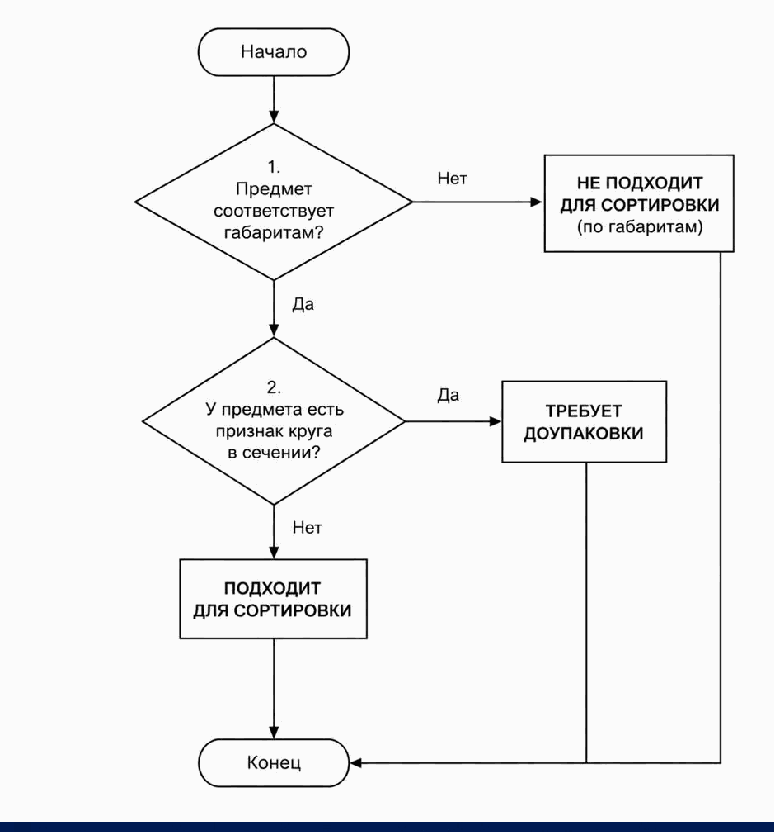
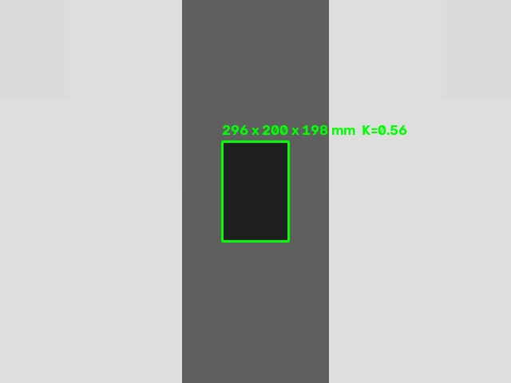

# Правила классификации и измерение товара

> Раздел отчёта, актуален для `v0.5-stable-stream` (обновлён 18.07). Формальные правила — `docs/md/task.md`,
> эталонные характеристики 11 моделей — `docs/md/models.md`, результаты прогонов —
> `docs/experiments.md`. Раздел описывает фактический код текущего `main` и его
> подтверждённые ограничения.

## Что определяет система

Камера над лентой должна отнести каждый товар к одной из трёх зон:

| Категория | Смысл | Условие |
|---|---|---|
| B | подходит для основного сортировщика | габариты допустимы, круга в сечении нет |
| C | не подходит по габаритам | хотя бы один габарит вне допустимого диапазона |
| D | требуется доупаковка | габариты допустимы, `K > 0.8` |

Габариты сортируются по убыванию. Допустимый диапазон строгий: товар должен быть
больше `10 × 10 × 10` мм и меньше `450 × 320 × 320` мм. Признак круга
`K = r_вписанной / R_описанной`; кругом считается сечение только при `K > 0.8`.

Приоритет правил принципиален:

1. Сначала проверяются габариты. Нарушение любого предела сразу даёт C.
2. Только для допустимых габаритов проверяется круг в сечении: `K > 0.8` даёт D.
3. Остальные товары относятся к B.



Единственная реализация строгих правил находится в `src/classification.py`;
пороговые значения — только в `src/constants.py`. ROS-ноды и скрипты не копируют
эти числа, а вызывают общее ядро.

## Как получаются признаки из depth-кадра

`perception_node` получает depth-изображение и параметры камеры через
`ros_gz_bridge`. Чистая геометрия вынесена в `src/perception.py` и выполняет:

1. сегментацию пикселей, которые находятся не менее чем на 5 мм выше ленты;
2. отказ от измерения, пока товар касается границы кадра и виден не полностью;
3. построение выпуклой оболочки маски;
4. оценку двух размеров в плоскости ленты ориентированным прямоугольником (OBB),
   чтобы поворот вокруг вертикальной оси не раздувал обычный AABB;
5. оценку высоты по первому перцентилю глубины маски — это сохраняет высокий
   бортик вогнутой Тарелки и устойчиво к единичным выбросам;
6. расчёт `K` **по проекциям** (согласовано с ответом организаторов на QA
   18.07 — «K смотреть по проекции»): берётся максимум из двух проекций —
   верхнего силуэта (выпуклая оболочка маски) и восстановленной по depth
   **торцевой проекции** — сечения перпендикулярно длинной оси. Второе ловит
   скрытый круг лежащего тела вращения (Бутылка сверху прямоугольна, но её
   торцевое сечение — круг → D). Торцевой круг засчитывается только при позе
   «касание ленты» (tau≈2) и малой невязке круга, иначе скруглённый квадрат
   Цилиндра ложно ушёл бы в D;
7. перевод центра маски в мировые координаты по калибровке камеры.

Пайплайн работает **только по depth-геометрии и не читает цвет** — поэтому он
инвариантен к окраске товара по построению (организаторы на QA 18.07 подтвердили,
что цветовая палитра товаров произвольна; наше решение к этому устойчиво без
единой правки).



Для Короба 300 в штатной позе получено `296 × 200 × 198` мм и `K = 0.56`
при эталоне `300 × 200 × 200` мм. После перехода с AABB на OBB повёрнутый короб,
который ошибочно измерялся как `341 × 322` мм, измеряется как `302 × 228` мм и
остаётся в правильной категории B.

## Стабилизация по нескольким кадрам

Один товар виден примерно в десятке последовательных кадров. Реагировать на каждый
кадр отдельно нельзя: перспектива и частичная видимость вызывали флипы B↔C↔D.
`src/aggregation.py` группирует измерения по `item_id` и публикует:

- покомпонентную медиану трёх габаритов;
- медиану `K`;
- `confidence`, растущую до полного значения за пять согласованных кадров и
  уменьшающуюся при разбросе размеров или `K`.

После агрегации применяется консервативная политика: товар категории B, измеренный
ближе 5 мм к габаритной границе, направляется в C. Полоса не применяется к порогу
`K = 0.8`, потому что симметричное правило ошибочно отправило бы Шлем (`K = 0.78`)
в D. Обработка позднего флипа в контроллере оставлена как страховка, но основная
стабилизация выполняется до управляющего решения.

## Пограничные модели

| Модель | Эталон | Почему это важно |
|---|---|---|
| Цилиндр | B, `K = 0.74` | название не определяет класс: стяжки делают сечение некруглым |
| Шлем | B, `K = 0.78` | находится рядом с порогом, но полоса неопределённости по K не вводится |
| Ручка | C, минимальный размер 9 мм | габариты имеют приоритет над круглым сечением |
| Пуфик | C, максимальный размер 489 мм | превышение габаритов имеет приоритет над круглым сечением |

Эти случаи закреплены юнит-тестами строгого правила, консервативной политики и
агрегации. Они не считаются доказанными end-to-end для случайных ориентаций, пока
не завершён полный матричный прогон.

## Результат: полная матрица 33/33 ×3

День-4 матрица была лишь первым прогоном; актуальный статус — **три полных
body-scored census на финальном `cell_diverter.sdf`: 33/33 ×3, классификация
без ошибок** (все 11 моделей × 3 seed-ориентации; `docs/experiments.md`,
`mechanism.md`). Ранние промахи закрыты и разобраны:

- **Бутылка 0/3 → 3/3 D.** Причина была не в правиле, а в измерении: одна верхняя
  проекция читала лежащую Бутылку как прямоугольник (`K≈0.30`). Добавлена торцевая
  проекция (сечение перпендикулярно длинной оси, восстановленное по depth) —
  скрытый круг найден, `K→1.0`, маршрут D.
- **Мешок `K=0.79–0.87` (флип у порога) → устойчиво B.** Мешок — не плоский диск:
  силуэтная «круглость» гейтится проверкой плоскостности (высота/диаметр), а
  торцевой круг — гейтом удлинённости; мягкий блоб не проходит оба.
- **Короб 400 C, Ручка C, Пуфик C, Цилиндр B, Шлем B** — все на правильной стороне;
  разбор по причине (perception / подача / механизм / критерий зоны) сохранён,
  чтобы суммарный PASS не скрывал источник.

Перенос правил на **неизвестные формы** проверен отдельно: `measure_private_shapes.py`
на 12 процедурных depth-сценах (призмы, эллипсы, тонкий 9 мм, крупный круг) без
знания имени модели дал **12/12** — это проверка логики правил, а не запоминание
11 STL (уточнение организаторов 16.07).

## Честные ограничения (актуальные)

Прежнее ограничение «одна верхняя проекция недостаточна для лежащего тела
вращения» **снято** торцевой проекцией. Остаются узкие, честно зафиксированные
границы:

- **Плотное касание «грань в грань».** Два товара, слитые ровной гранью в один
  прямоугольный силуэт, из top-view неразделимы (нет шейки-вогнутости); на наборе
  сложных сцен это единственный `merge`-случай (split=0, merge=1, phantom=0,
  `measure_hard_scenes.py`). Разнесённые и угловые касания разделяются.
- **Торцевая проекция опирается на depth-рельеф** видимой верхней поверхности;
  при слишком плоском облаке (крышка короба) она не активируется — но там скрытого
  круга и нет.
- Стоящая на торце Ручка (9 мм в плане, 15 px) ниже порога детекции — на движущейся
  ленте она заваливается плашмя; документированный предел, не цель фикса.

Система больше **не** «однокамерный бейзлайн»: depth-геометрия восстанавливает и
верхнюю, и торцевую проекцию, что и закрывает критерий «круг в любом сечении» на
эталонном наборе. Дальнейшие усложнения (боковая камера, нейросеть) по правилу
проекта обязаны побить текущий результат числом — а бить нечего (33/33).

## Воспроизводимость

```bash
# один товар в заданной категории
bash scripts/run_skeleton.sh box_300x200x200 B

# все товары × три воспроизводимые ориентации, seed 0
bash scripts/run_matrix.sh 0 3
```

Ориентация каждой ячейки однозначно определяется тройкой
`(seed, item_index, orient_index)`, поэтому любой сбой можно повторить отдельно.
