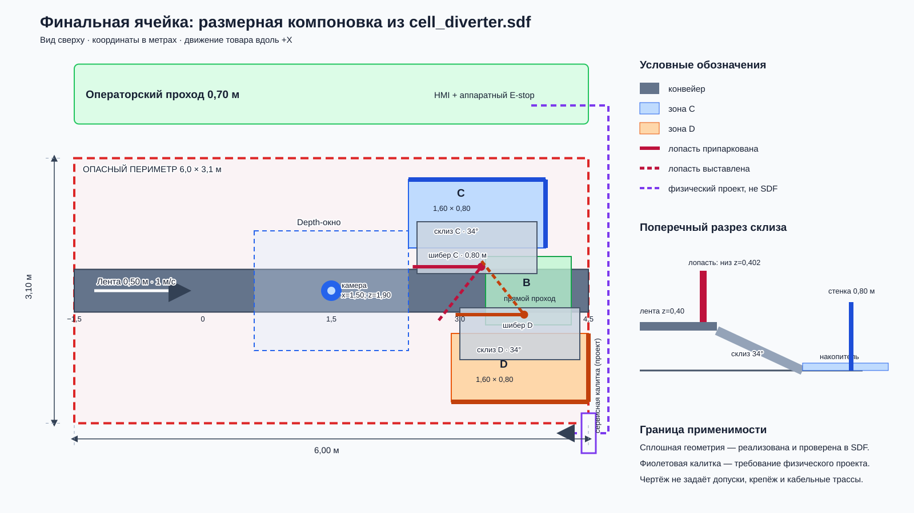

# Компоновка исполнительной ячейки

> Размерный план получен из фактической геометрии
> `sim/worlds/cell_diverter.sdf`, а не нарисован «по мотивам» симуляции.
> Это компоновочный и кинематический материал для отчёта, но не комплект
> производственных чертежей: допуски, крепёж, кабельные трассы и STEP-сборка
> физической установки пока не разработаны.

## Размеры и координаты

Система координат совпадает с Gazebo: X — вдоль движения ленты, Y — поперёк,
Z — вверх. Все координаты ниже в метрах.

| Узел | Положение / габарит | Инженерный смысл |
|---|---|---|
| Рабочий периметр | `x=-1.5..4.5`, `y=-1.55..1.55` — 6.0×3.1 | Красная зона с движущейся лентой, шиберами и местами падения; во время работы вход запрещён |
| Операторский проход | `x=-1.5..4.5`, `y=1.95..2.65` — ширина 0.70 | Доступ к HMI/E-stop вне опасного периметра; в симуляции это visual-only разметка |
| Лента | ширина 0.50, поверхность `z=0.40`, скорость 1.0 м/с | Непрерывный транспорт вдоль +X; длинная подвижная плита SDF имеет запас хода 20 м для потокового эпизода |
| Камера | `(1.50, 0, 1.90)`, взгляд вниз | Механика и склизы начинаются за дальним краем окна, чтобы не становиться ложными depth-компонентами |
| Прозрачные бортики камеры | `y=±0.272`, сечение 0.04×0.18; +Y: `x=0.70..2.43`, −Y: `x=0.70..2.93` | Непрерывно передают товар от входных реек к припаркованным лопастям; в SDF это collision без visual — аналог прозрачного поликарбоната, поэтому depth-камера их не сегментирует |
| Шибер C | pivot `(3.25, +0.28, 0.552)`, лопасть 0.80×0.03×0.30 | Поворот 0→0.90 рад; направляет товар к +Y, в зону C |
| Шибер D | pivot `(3.75, −0.28, 0.552)`, лопасть 0.80×0.03×0.30 | Сдвинут на 0.50 м по X, чтобы припаркованные лопасти не перекрывали друг друга; направляет к −Y |
| Склиз C | центр `(3.20, +0.50, 0.17)`, 1.40×0.605×0.02, roll −0.597 | Спуск от кромки ленты к зоне без баллистического броска; верх ниже лопасти, чтобы не клинить её |
| Склиз D | центр `(3.70, −0.50, 0.17)`, 1.40×0.605×0.02, roll +0.597 | Зеркальный канал категории D |
| Зона B | центр `(3.80, 0)`, 1.00×0.80 | Товар не получает механического воздействия и продолжает движение прямо |
| Клетка C | центр `(3.20, +0.90)`, основание 1.60×0.80 | Дальняя и торцевая стенки высотой 0.80; открыта со стороны склиза |
| Клетка D | центр `(3.70, −0.90)`, основание 1.60×0.80 | Зеркальная накопительная зона категории D |

Низ лопасти находится на `z=0.402`, то есть на 2 мм выше поверхности ленты.
Это достаточно низко для Ручки высотой 9 мм, но исключает пересечение лопасти с
конвейером. Склиз начинается примерно на `z=0.34`, ниже лопасти, и заканчивается
на уровне пола; фактический перепад снимается наклоном 0.597 рад (34°).

Прозрачные бортики — **внутренняя технологическая направляющая**, а не внешнее
safety-ограждение для людей. Их верх находится на `z=0.48` (80 мм над лентой):
этого достаточно, чтобы удержать подтверждённую наклонную позу Шлема, но это не
защищает оператора от доступа к механизмам. Внешний красный периметр, калитка и
межблокировки описываются отдельно ниже.

## Кинематические и эксплуатационные зазоры

- Лопасть длиной 0.80 м при `0.90 рад` перекрывает ленту шириной 0.50 м и
  встречает товар плоскостью, а не концом.
- Шиберы разнесены по X на 0.50 м. Между товарами разных зон планировщик
  резервирует время удержания 2.5 с и возврата 0.6 с; близкие товары одной зоны
  могут идти плотнее, потому что уже выставленная лопасть остаётся полезной.
- Склизы начинаются за окном камеры и перекрывают всю длину соответствующих
  накопителей. Торцевая стенка находится downstream и останавливает катящиеся
  бутылки; со стороны ленты стенки нет, иначе она закрыла бы вход со склиза.
- Максимальный проверенный товар 489 мм шире ленты, но центрируется телом, а не
  origin модели. Расширение ленты отвергнуто экспериментом: маршрутизация не
  улучшилась, а бережность стала вдвое хуже.

## Доступ для обслуживания и граница безопасности

В симуляции красный периметр и зелёный проход — только визуальная разметка,
поэтому текущий SDF подтверждает геометрию и программный E-stop, но не
сертифицированное ограждение.

Для физического исполнения компоновка предусматривает:

1. HMI и аппаратный E-stop со стороны зелёного прохода, вне `y=1.55`.
2. Межблокированную сервисную калитку у downstream-торца `x=4.5`. Через неё
   после LOTO доступны приводы обоих шиберов и торцевые стенки накопителей без
   прохода над лентой.
3. Съёмные склизы и открытые со стороны подачи клетки: товар и мусор извлекаются
   после снятия энергии, не демонтируя камеру и направляющие подачи.
4. Свободную полосу 0.40 м между красным периметром `y=1.55` и операторским
   проходом `y=1.95`; она не считается рабочим проходом и отделяет оператора от
   ограждения.

Калитка, аппаратное снятие энергии, крепёж и кабельные трассы на схеме показаны
как требования физического проекта, но **не реализованы в SDF**. Перед
изготовлением нужны оценка рисков, проверка зон досягаемости, расчёт прочности
лопасти/шарнира и выпуск STEP-сборки с допусками.

## Связь компоновки с проверками

- Геометрия обоих миров покрыта XML-контрактными тестами, а
  `bash scripts/check_sdf.sh` передаёт парсеру Gazebo каждый `sim/worlds/*.sdf`
  и все 11 товарных моделей. Отдельный тест не позволяет снова получить зелёную
  проверку только legacy-мира без финального `cell_diverter.sdf`.
- Два полных census слитого main после добавления прозрачных бортиков и 3D
  body-OBB: `33/33 + 33/33`; ни одна из 66 ячеек не разошлась.
- Шибер выбран против толкателя по маршрутизации и измеренной бережности;
  расчёт вращательной составляющей не отменяет преимущество на крупном коробе.
- `scripts/smoke_estop_stream.sh` проверяет остановку занятой ячейки: лента и
  товары останавливаются, а позиционный шибер не уезжает в парковку из-под груза.
